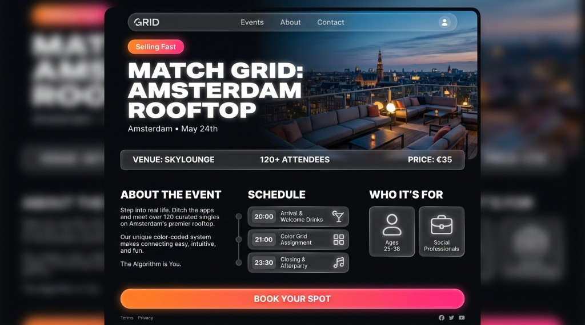
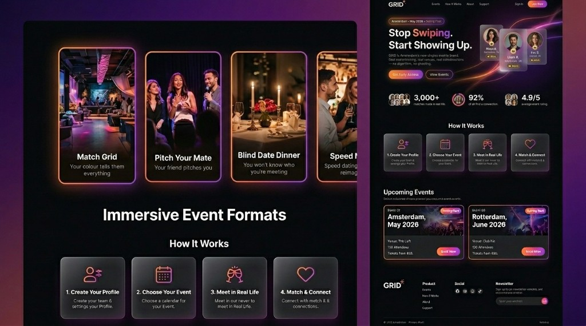
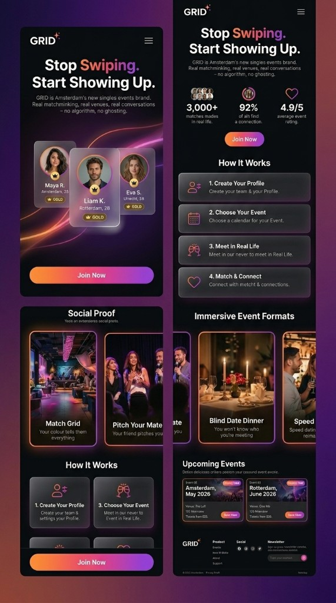
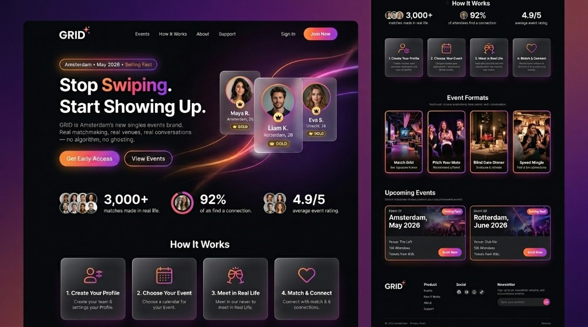

# GRID - Real Life Dating Events

A premium social events brand website for real-life matchmaking in Amsterdam and beyond.  
**No swiping, no algorithms - just real connections in curated venues.**

## About GRID

GRID reimagines dating events by bringing people together in real venues for genuine conversations and authentic connections. This project is the marketing + conversion website that presents the concept, event formats, social proof, and upcoming event journeys.

## What Is Implemented

- Multi-page experience with routing (`/`, `/events`, `/events/:id`, `/how-it-works`, `/about`, `/join-waitlist`)
- Reusable section components for hero, social proof, format cards, event listings, and footer
- Event details page with info bar, audience targeting, and timeline schedule
- Shared event data model in `src/data/events.ts`
- Responsive glassmorphism + neon visual style based on the GRID brand direction

## Here's how I translated the product idea into a high-conversion experience

These are the concept-to-build screens I designed myself in Stitch, then translated into this React + TypeScript implementation.

### Design references






### Conversion thinking behind the build

- Clear above-the-fold value proposition ("Stop Swiping. Start Showing Up.")
- Trust builders early (social proof stats + premium venue framing)
- Short path to action (`Join Now`, `Book Spot`, event-level CTAs)
- Event-specific clarity (price, audience, schedule, venue in one glance)
- Mobile-first readability with strong contrast and tap-friendly sections

## Tech Stack

- React 19
- TypeScript
- Vite
- Tailwind CSS v4
- React Router
- Lucide React
- Motion

## Getting Started

### Prerequisites

- Node.js 18+ recommended
- npm

### Installation

```bash
git clone https://github.com/yourusername/grid-real-life-dating-events.git
cd grid-real-life-dating-events
npm install
npm run dev
```

The app runs at `http://localhost:3000`.

## Scripts

- `npm run dev` - start Vite dev server on port 3000
- `npm run build` - create production build
- `npm run preview` - preview production build
- `npm run lint` - TypeScript check (`tsc --noEmit`)
- `npm run clean` - remove `dist/`

## Project Structure

```text
.
├── docs/
│   └── designs/                 # Stitch design references used in README
├── src/
│   ├── components/
│   │   ├── EventAudience.tsx
│   │   ├── EventCard.tsx
│   │   ├── EventFormats.tsx
│   │   ├── EventHero.tsx
│   │   ├── EventInfoBar.tsx
│   │   ├── EventSchedule.tsx
│   │   ├── Footer.tsx
│   │   ├── Hero.tsx
│   │   ├── HowItWorks.tsx
│   │   ├── Navbar.tsx
│   │   ├── NeonBackground.tsx
│   │   ├── SocialProof.tsx
│   │   └── UpcomingEvents.tsx
│   ├── data/
│   │   └── events.ts            # Event dataset and helper
│   ├── pages/
│   │   ├── AboutPage.tsx
│   │   ├── EventDetails.tsx
│   │   ├── EventsPage.tsx
│   │   ├── HomePage.tsx
│   │   ├── HowItWorksPage.tsx
│   │   └── JoinWaitlistPage.tsx
│   ├── App.tsx                  # Router and layout shell
│   ├── index.css
│   └── main.tsx
├── index.html
├── package.json
├── tsconfig.json
└── vite.config.ts
```

## Build and Deployment

```bash
npm run build
```

Production output is generated in `dist/`.

---

**Copyright (c) 2026 GRID Amsterdam**
